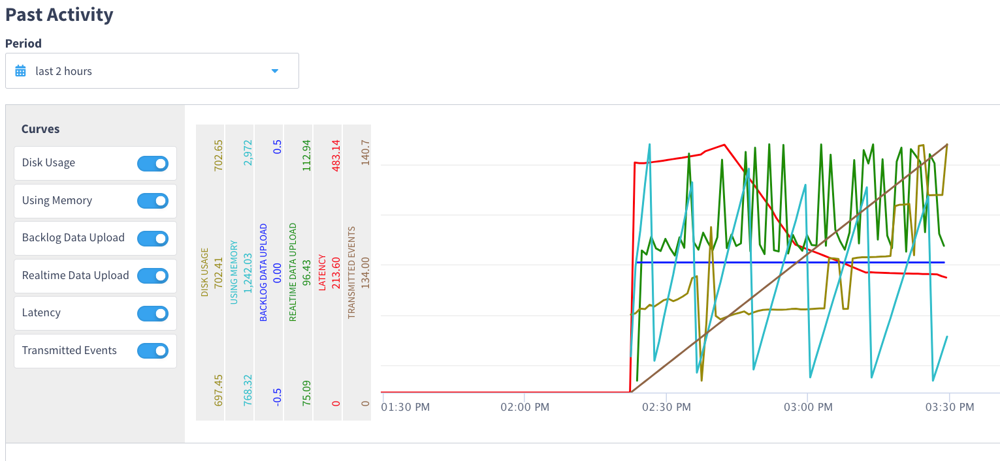
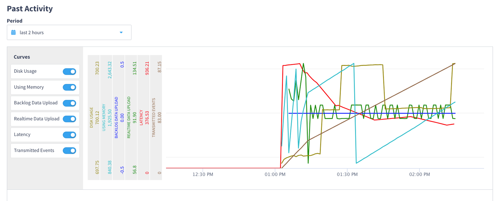

# Liverig 5.17.0 - Features and improvements

## Witsml realtime log request improvements

### Brief

Standard WITSML uses GET and POST methods and sometimes we need to know if one given growing object has changed or not.

Thus to avoid unecessary WITSML request to server a new feature has been added to Liverig to increase performance requests

### Disabling original real-time pooling mechanism in the collector

- Setting _**witsml_change_mechanism_feature** = true_
- check if new raw events are arriving in Live
- check if ___source_metrics_ events are arriving in Live(the number of source metric events will reduce drastically because it doesn’t have unnecessary pooling if compared with the previous pooling mode)

### Properties configuration

- `witsml_change_mechanism_feature` - Enables a mechanism for identifying change for data objects in a WITSML server.
- `witsml_change_mechanism_delay_period_in_seconds` - The number of seconds for the client to detect a change in a growing data object.
- `witsml_change_mechanism_detection_period_in_seconds` - The number of seconds for the client delayed to start
- `witsml_change_mechanism_initial_last_change_feature` - Enables the use of a default initial lastChange when starts the feature
- `witsml_change_mechanism_initial_last_change_in_minutes` - The number of minutes before now for use as the default last change for an initial request

### Conclusions

Every `witsml_change_mechanism_detection_period_in_seconds` (default is 10 seconds), a query is performed per object, and if changes are detected, WITSML requests are made only for the updated objects.

Many WITSML queries will be executed initially, but the number of queries will decrease after loading historical data(using a backlog).

Initially, the WITSML Store response time may increase (we can use an initial default `dTimLastChange` to detect only recent objects), but this response time will decrease after the initial phase.

There are no empty responses for real-time data.

Memory usage was 11% lower compared to the polling mode.

The transfer of backlog data to real-time data is faster than in polling mode because, during initialization, it does not wait for the `request.query_period` to make a new request.

### Pooling Mechanism x WITSML Change Mechanism

Pooling Mode

WITSML Change mode

